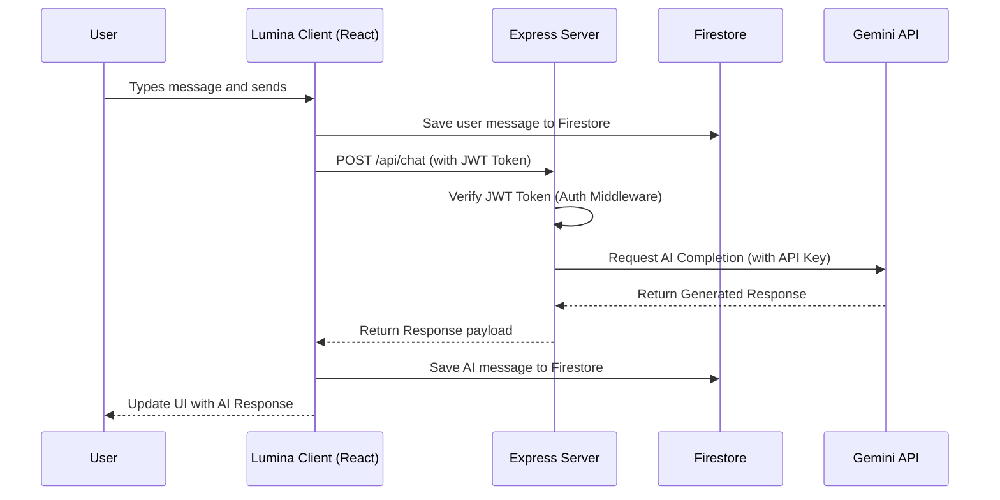
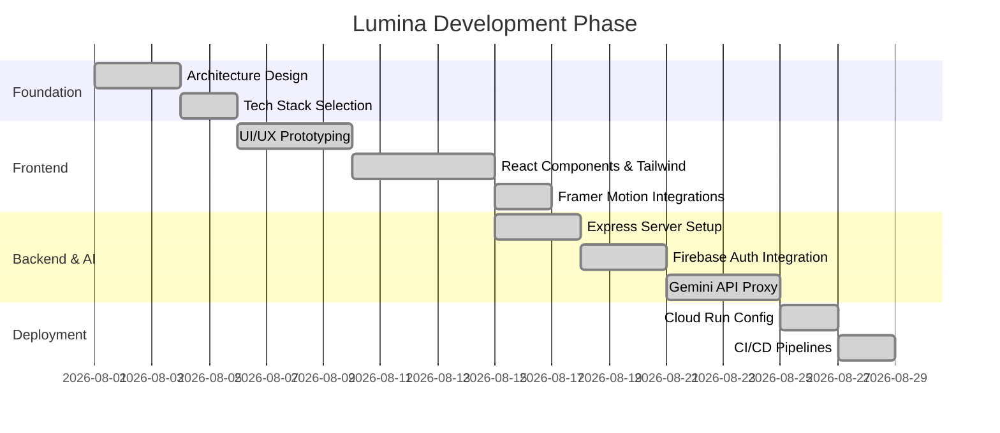

<div align="center">
  <h1>✨ Lumina</h1>
  <p><strong>The Professional AI Workspace & Cognitive Synthesizer</strong></p>
  
  <p>
    
    
    
    
    
  </p>
</div>

<hr/>

Lumina is a premium, full-stack AI research and chat workspace designed for deep cognitive synthesis. It features a sophisticated, responsive interface built with React and Tailwind CSS, backed by a secure Node.js/Express server integrating the latest Google Gemini models.

## 🌟 Key Features

- **Omni-Cognitive Synthesis**: Seamless integration with Gemini 3.5 Flash for both standard chat and deep research modes.
- **Secure Data Persistence**: Real-time synchronization of chat sessions and histories using Firebase Firestore.
- **Zero-Trust Backend**: Server-side proxying of all AI requests with strict JWT bearer token validation. API keys are never exposed to the client.
- **Top-Tier Aesthetics**: A beautifully crafted, distraction-free dark mode UI featuring Framer Motion transitions and fluid typography.

## 🛠️ Tech Stack

### Frontend
- **React 19**: Modern component-based architecture.
- **Vite 6**: Blazing fast build tool and dev server.
- **Tailwind CSS 4**: Utility-first styling for premium design.
- **Framer Motion**: Fluid, physics-based micro-animations.

### Backend & Cloud
- **Node.js & Express**: Secure, high-performance API server.
- **Google Gemini SDK**: Core AI engine powering the workspace.
- **Firebase Firestore**: Scalable NoSQL database with real-time listeners.
- **Firebase Auth**: Secure, passwordless and OAuth identity management.
- **Google Cloud Run**: Serverless deployment for auto-scaling.

## 📐 System Architecture

### Component Architecture
```mermaid
graph TD
    subgraph Client [Client-Side Application]
        UI[React + Tailwind UI]
        AuthClient[Firebase Auth SDK]
        State[Local State / Context]
    end

    subgraph Backend [Cloud Run Backend / Express]
        API[API Router /api/*]
        Middle[Auth Middleware]
        GenAI[Google Gen AI SDK]
    end
    
    subgraph Google Cloud & Firebase
        Firestore[(Firestore DB)]
        Identity[Firebase Auth]
        Gemini[Gemini API]
        Secrets[Secret Manager]
    end

    UI -->|JWT Bearer Token| API
    UI -->|Direct Read/Write| Firestore
    UI <-->|Login/Tokens| AuthClient
    AuthClient <--> Identity
    
    API --> Middle
    Middle -.->|Verifies Token| Identity
    Middle --> GenAI
    GenAI -->|Uses GEMINI_API_KEY| Gemini
    Secrets -->|Injects| GenAI
    
    style Client fill:#1e293b,stroke:#3b82f6,color:#fff
    style Backend fill:#1e293b,stroke:#10b981,color:#fff
    style Google Cloud & Firebase fill:#1e293b,stroke:#f59e0b,color:#fff
```

### AI Message Processing Flow


## 📈 Building Phase & Project Lifecycle



## 🔐 Security & Database Configuration

Lumina implements strict **User Data Isolation**. Users can only read and write their own data.

### 1. Firestore Security Rules

Navigate to the Firebase Console and deploy the following `firestore.rules`:

```javascript
rules_version = '2';
service cloud.firestore {
  match /databases/{database}/documents {
    // User profile and settings isolation
    match /users/{userId} {
      allow read, write: if request.auth != null && request.auth.uid == userId;
      
      // Nested chat sessions isolation
      match /sessions/{sessionId} {
        allow read, write: if request.auth != null && request.auth.uid == userId;
      }
    }
  }
}
```

## 💻 Local Development

To run the application locally:

1. Clone the repository and install dependencies:
   ```bash
   git clone https://github.com/Anurag-tech22/lumina.git
   cd lumina
   npm install
   ```
2. Create a `.env` file in the root directory:
   ```env
   VITE_FIREBASE_API_KEY="your_api_key"
   VITE_FIREBASE_AUTH_DOMAIN="your_domain"
   VITE_FIREBASE_PROJECT_ID="your_project_id"
   VITE_FIREBASE_STORAGE_BUCKET="your_bucket"
   VITE_FIREBASE_MESSAGING_SENDER_ID="your_sender_id"
   VITE_FIREBASE_APP_ID="your_app_id"
   GEMINI_API_KEY="your_gemini_api_key_for_local_dev"
   ```
3. Start the unified development server:
   ```bash
   npm run dev
   ```

## ☁️ Deployment Guide (Google Cloud Run)

Follow these steps to configure, secure, and deploy Lumina to Google Cloud Run.

### 1. Secret Management Setup
Never hardcode your Gemini API key. Use Google Cloud Secret Manager to inject it securely at runtime.

```bash
# Create the secret in Secret Manager
gcloud secrets create GEMINI_API_KEY --replication-policy="automatic"

# Populate the secret with your actual API key
echo -n "YOUR_GEMINI_API_KEY" | gcloud secrets versions add GEMINI_API_KEY --data-file=-

# Grant the default Cloud Run service account access to read the secret
gcloud secrets add-iam-policy-binding GEMINI_API_KEY \
  --member="serviceAccount:YOUR_PROJECT_NUMBER-compute@developer.gserviceaccount.com" \
  --role="roles/secretmanager.secretAccessor"
```

### 2. Deploy to Cloud Run

Run the following command to deploy the unified Express + Vite application.

```bash
gcloud run deploy lumina-workspace \
  --source . \
  --region=us-central1 \
  --allow-unauthenticated \
  --update-secrets=GEMINI_API_KEY=GEMINI_API_KEY:latest \
  --update-labels=dev-tutorial=cloud-run-ai-challenge
```

---
<div align="center">
  <i>Architected for speed, security, and cognitive scale.</i>
</div>
