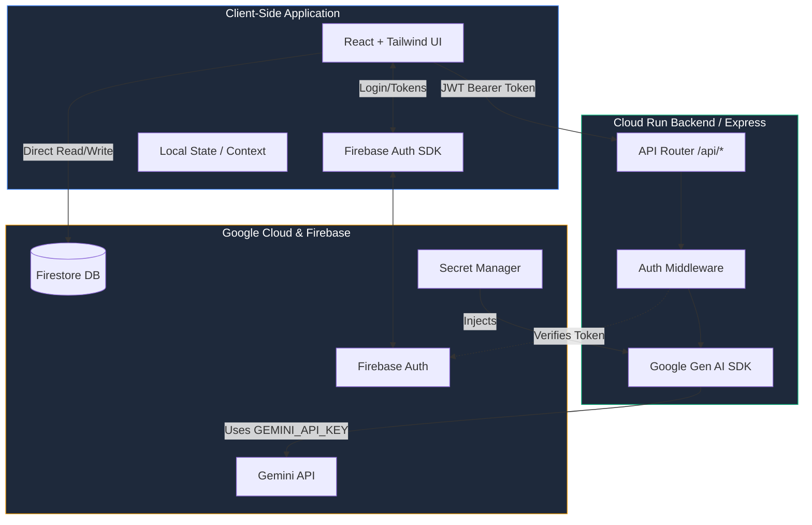
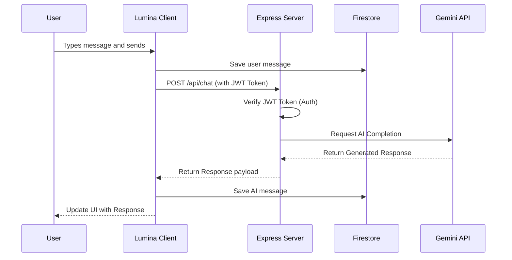

<div align="center">

  

  <h1 align="center">✨ Lumina Workspace</h1>

  <p align="center">
    <strong>A Professional AI Workspace & Cognitive Synthesizer</strong>
    <br />
    <a href="https://github.com/Anurag-tech22/lumina"><strong>Explore the docs »</strong></a>
    <br />
    <br />
    <a href="https://github.com/Anurag-tech22/lumina">View Demo</a>
    ·
    <a href="https://github.com/Anurag-tech22/lumina/issues">Report Bug</a>
    ·
    <a href="https://github.com/Anurag-tech22/lumina/issues">Request Feature</a>
  </p>

  <p align="center">
    <a href="https://github.com/Anurag-tech22/lumina/blob/main/LICENSE">
      
    </a>
    
    
    
    
  </p>
</div>

---

<details>
  <summary><strong>📖 Table of Contents</strong></summary>
  <ol>
    <li><a href="#-about-the-project">About The Project</a></li>
    <li><a href="#-key-features">Key Features</a></li>
    <li><a href="#-architecture">Architecture</a></li>
    <li><a href="#-getting-started">Getting Started</a></li>
    <li><a href="#-deployment">Deployment</a></li>
    <li><a href="#-security">Security</a></li>
    <li><a href="#-license">License</a></li>
  </ol>
</details>

---

## 🌌 About The Project

> **Lumina is a premium, full-stack AI research and chat workspace designed for deep cognitive synthesis.** 

Unlike basic chat interfaces, Lumina offers **Omni-Cognitive Synthesis** and deep research capabilities, serving as a dedicated, fully-isolated personal vault for your thoughts and ideas. It provides a sophisticated, responsive interface built with React and Tailwind CSS, backed by a secure Node.js/Express server that seamlessly integrates the latest Google Gemini models.

---

## ✨ Key Features

| Feature | Description |
| :--- | :--- |
| 🧠 **Omni-Cognitive Synthesis** | Seamless integration with Gemini 3.5 Flash for advanced chat and deep research. |
| 🔒 **Secure Data Persistence** | Real-time synchronization of chat sessions using Firebase Firestore. |
| 🛡️ **Zero-Trust Backend** | Server-side proxying of all AI requests with strict JWT bearer token validation. |
| 🎨 **Top-Tier Aesthetics** | A beautifully crafted, distraction-free dark mode UI featuring fluid typography. |

---

## 📐 Architecture

Lumina utilizes a robust client-server architecture with server-side AI processing to maximize security.

### 🔄 Component Flow



### 💬 AI Message Processing



---

## 🚀 Getting Started

To get a local copy up and running, follow these simple steps.

### Prerequisites
* **Node.js** (v18 or higher)
* **npm** (v9 or higher)

### Installation

1. **Clone the repo**
   ```sh
   git clone https://github.com/Anurag-tech22/lumina.git
   cd lumina
   ```
   
2. **Install NPM packages**
   ```sh
   npm install
   ```
   
3. **Configure Environment Variables**
   Create a `.env` file in the root directory:
   ```env
   VITE_FIREBASE_API_KEY="your_api_key"
   VITE_FIREBASE_AUTH_DOMAIN="your_domain"
   VITE_FIREBASE_PROJECT_ID="your_project_id"
   VITE_FIREBASE_STORAGE_BUCKET="your_bucket"
   VITE_FIREBASE_MESSAGING_SENDER_ID="your_sender_id"
   VITE_FIREBASE_APP_ID="your_app_id"
   GEMINI_API_KEY="your_gemini_api_key_for_local_dev"
   ```
   
4. **Start the development server**
   ```sh
   npm run dev
   ```

---

## ☁️ Deployment

Lumina is designed to be easily deployed to Google Cloud Run. 

### 1. Secret Management Setup
Never hardcode your API keys. Inject them securely using Secret Manager.
```sh
gcloud secrets create GEMINI_API_KEY --replication-policy="automatic"
echo -n "YOUR_GEMINI_API_KEY" | gcloud secrets versions add GEMINI_API_KEY --data-file=-

gcloud secrets add-iam-policy-binding GEMINI_API_KEY \
  --member="serviceAccount:YOUR_PROJECT_NUMBER-compute@developer.gserviceaccount.com" \
  --role="roles/secretmanager.secretAccessor"
```

### 2. Deploy to Cloud Run
```sh
gcloud run deploy lumina-workspace \
  --source . \
  --region=us-central1 \
  --allow-unauthenticated \
  --update-secrets=GEMINI_API_KEY=GEMINI_API_KEY:latest
```

---

## 🛡️ Security

Lumina implements strict **User Data Isolation**. Users can only read and write their own data. Navigate to the Firebase Console and deploy the following `firestore.rules`:

```javascript
rules_version = '2';
service cloud.firestore {
  match /databases/{database}/documents {
    match /users/{userId} {
      allow read, write: if request.auth != null && request.auth.uid == userId;
      match /sessions/{sessionId} {
        allow read, write: if request.auth != null && request.auth.uid == userId;
      }
    }
  }
}
```

---

## 📄 License

Distributed under the MIT License. See `LICENSE` for more information.

<p align="right"><a href="#-lumina-workspace">⬆️ Back to top</a></p>
